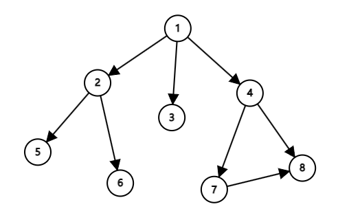

# 树与图

## 树与图的概念

图的概念在离散数学中有所涉及，这里我们再简单的概括一下：给定若干个点，点与点之间存在着一些边（有方向的），这些点和边即可构成一张**图**。计算机图论中，一般将图分成有向图和无向图（无向图的边可以视为两条有向边）。

在一张有向图中，从某个点出发的边的数量被称为这个点的入度；相反，指向这个点的边的数量被称为点的入度。对于无向图，与之相连的边的数量就被称为度。

一条边一般包含三个属性：起点，终点和边权（距离，长度等，未说明的情况可以视为1）。

在无向图中，没有环的联通图被视为一个**树**。显然，一个树有 $n-1$ 条边。（特指无根树，有根树在具体定义上略有差异）

## 树与图的存储

对于无根树（有根树的存储方式可以参照基础篇的二叉树章节），其存储方式和普通图没有区别。

### 邻接矩阵

我们创建一个 $n*n$ 大小的矩阵，其中 $f_{i,j}$ 表示节点 $i,j$ 之间的情况（值表示从 $i$ 到 $j$ 有几条边/边的边权）。

这种存储结构可以快速查阅两点之间是否有边，但是空间复杂度奇高，而且需要花费大量时间在访问不存在的边上。

### 邻接表

我们尝试创建一个数组 $\{G_n\}$，其中 $G_i$ 表示一个链表/数组，存放着从 $i$ 出发的所有边。这种方式大幅度减少了空间消耗，因此是目前最为主流的存图方式。当然，这种结构无法快速判断两个节点之间是否存在一条边。

邻接表有两种实现方式：

1. vector数组

   这种方式利用了vector的可变特性，写起来很方便，但是常数较大。

   ```cpp
   // 默认是无边权图，就只存放节点了
   vector<int> G[N];
   void addEdge(int x, int y) {
       G[x].push_back(y);
   }
   //遍历节点x的所有出边(指向的节点y)
   for (int y : G[x]) {
       // 使用了C++11的特性，看起来较为简洁
   }
   ```

2. 链式前向星

   这种方式本质上就是vector套链表（数组模拟），写起来较为繁琐，但是常数较小

   ```cpp
   // 初始值均为0(也可以是-1)
   int tot = 0, Head[N], ver[M], Next[M];
   void addEdge(int x, int y) {
       ver[++tot] = y;
       Next[tot] = Head[x], Head[x] = tot;
   }
   //遍历节点x的所有出边(指向的节点y)
   for (int i = Head[x]; i; i = Next[i]) {
       int y = ver[i];
   }
   ```

## 图的遍历

图的遍历，是指按照某种规则，不重复不遗漏的访问图上的各节点。对于图的遍历，我们有两种方式：深度优先遍历（DFS）和广度优先遍历（BFS）。

这形式，感觉和搜索很像？没错，深度优先/广度优先搜索的本质，就是在一张图上进行遍历，只不过这张图没有明确给出，而是以隐式的方式给出罢了（每个节点都代表搜索的一个状态）。随着图论、搜索和动态规划相关知识的进一步学习，大家对此会有新的体会。  

一个小知识：如果一个无向图中，可以从一个点出发，遍历到所有点，那么这张图就是**连通图**。

在下面的代码讲解部分，我们会默认使用vector数组的方式来存储这样一张图。



### 深度优先遍历

深度优先遍历（**D**epth-**F**irst **S**earch），它从一个起始点出发，访问某个与它相连的未被访问点，再以这个点作为起点，继续进行该流程，直到某个节点发现没有与之相连的未被访问点，那么便进行回溯，回到上一个节点来尝试访问其他的未被访问点，直到所有点都被访问完毕。

对于上面这张图，DFS的流程如下：

1. 以点1为起始点，访问**点1**
2. 从点1开始，访问相邻的未被访问点，即**点2**
3. 从点2开始，访问相邻的未被访问点，即**点5**
4. 点5没有可达的未被访问点，退回点2
5. 从点2开始，访问相邻的未被访问点，即**点6**
6. 点6没有可达的未被访问点，退回点2
7. 点2没有可达的未被访问点，退回点1
8. 点1开始，访问相邻的未被访问点，即**点3**
9. 点3没有可达的未被访问点，退回点1
10. 点1开始，访问相邻的未被访问点，即**点4**
11. 点4开始，访问相邻的未被访问点，即**点7**
12. 点7开始，访问相邻的未被访问点，即**点8**
13. 点8没有可达的未被访问点，退回点7
14. 点7没有可达的未被访问点，退回点4
15. 点4没有可达的未被访问点（点8已经被访问过了），退回点1
16. 点1没有可达的未被访问点，退出搜索

按照这种方式，图的遍历顺序为：$(1, 2, 5, 6, 3, 7, 8, 4)$。

这种搜索方式非常适合递归的写法，我们不妨简单写一下：

```cpp
void dfs(int x) {
    printf("%d\n", x);
    vis[x] = 1;
    for (int y : G[x])
        if (vis[y] == 0) dfs(y);
}
```

### 广度优先遍历

深度优先遍历（**B**readth-**F**irst **S**earch），它从一个起始点出发，访问所有与它相连的未被访问点。访问完毕后，在以此选取这些点作为起点，继续进行该流程，直到所有点都被访问完毕。

对于上面这张图，DFS的流程如下：

1. 以点1为起始点，访问**点1**
2. 随后，依次访问相邻点，分别是：**点2、点3、点4**
3. 随后从点2开始，依次访问相邻点，分别是：**点5、点6**
4. 点3没有未访问的相邻点，跳过
5. 随后从点4开始，依次访问相邻点，分别是：**点7、点8**
6. 点7、点8没有未访问的相邻点，跳过
7. 没有能够继续访问的点，搜索结束

按照这种方式，图的遍历顺序为：$(1, 2, 3, 4, 5, 6， 7, 8)$。

为了实现BFS，我们需要使用队列来进行操作：

```cpp
void bfs() {
    queue<int> q;
    q.push(1), vis[1] = 1;
    while (!q.empty()) {
        int x = q.front(); q.pop();
        printf("%d\n", x);
        for (int y : G[x])
            if (vis[y] == 0)
            	q.push(y), vis[y] = 1;
    }
}
```

## 拓扑排序

如果一张有向图不存在环，那么我们就称这张图为**有向无环图**（**D**irected **A**cyclic **G**raph，DAG）。在日常生活中，有很多模型可以转化为DAG模型，例如食物链（基本上没有循环吃的）、课程安排（学过A了才能学B，这个不可能成环的）、软件包依赖关系（某个软件依赖于另一个软件等待）。

对于一个DAG，我们往往需要理清它的“顺序”。换言之，我们需要根据这个图构造出一个序列，使得原图中的任意边 $(u,v)$，序列都保证 $u$ 在 $v$ 前面。转化到实际应用中，可以被理解为“按照这个顺序学习，就能不发生前置课程未修的状况”，或者“按照这个顺序安装软件，就不会出现某个它以来的软件未安装的错误”。

为了完成这一目标的算法，被称为“拓扑排序”。普通排序是对一个无序数列进行有序化处理，而拓扑排序是在一张拓扑结构上理清逻辑顺序，因而得名。

目前，拓扑排序最为广泛的实现如下：

1. 统计所有节点的入度
2. 将所有入度为0的点放入一个队列
3. 从队列中取出一个点
4. 访问所有和这个点相连的点，将它们的度数减去1
5. 如果某个点的度数被降到了0，就将其放入队列
6. 回到步骤3，直到队列为空

点出列的顺序就是拓扑序。

如果拓扑排序的算法中途出现问题（还没有遍历完所有的点就结束了），说明这张图并不是DAG（有环，或者不联通）。

```cpp
queue<int> q;
int indegree[N];
for (int x = 1; x <= n; ++x)
    for (int y : G[x]) ++indegree[y];
for (int i = 1; i <= n; ++i)
    if (indegree[i] == 0) q.push(i);
while (!q.empty()) {
    int x = q.front(); q.pop();
    printf("%d\n", x);
    for (int y : G[x]) {
        --indegree[y];
        if (indegree[y] == 0) q.push(y);
    }
}
```


## 课后习题

* [P5318 【深基18.例3】查找文献](https://www.luogu.com.cn/problem/P5318)
* [P2853 [USACO06DEC]Cow Picnic S](https://www.luogu.com.cn/problem/P2853)
* [P1113 杂务](https://www.luogu.com.cn/problem/P1113)